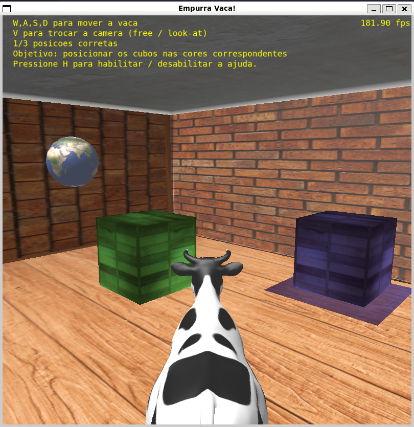
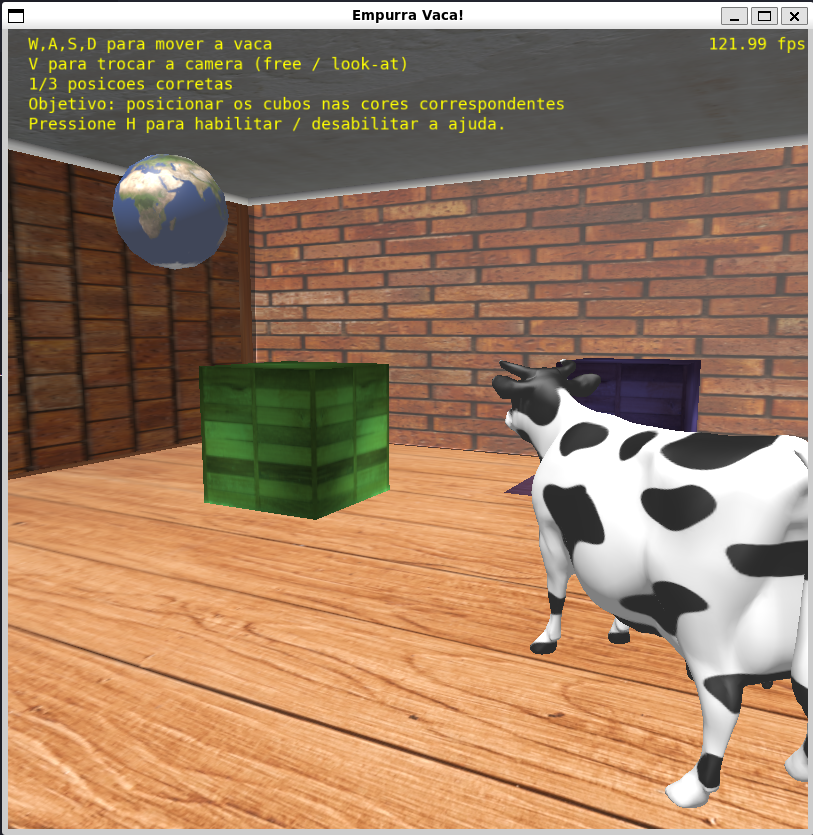

# Trabalho Final – Fundamentos de Computação Gráfica  

## Relatório

---

### Contribuições de cada membro

**Lucas:**  
- Desenvolvimento do cenário  
- Início do mapeamento de texturas  
- Instâncias de objetos  
- Testes de interseção com colisão  
- Modelos de iluminação e interpolação  
- Animações baseadas no tempo  
- Implementação da curva de Bézier cúbica  

**Vinicius:**  
- Início do core do projeto  
- Finalização do mapeamento de texturas  
- Implementação das câmeras (livre e look-at)  
- Transformações geométricas controladas pelo usuário  
- Lógica do jogo (caixas coloridas em áreas específicas)  
- Escrita dos textos com auxílio  

**Ambos:**  
- Colaboração na integração das funcionalidades  
- Refinamento conjunto das etapas e funcionalidades  

---

### Uso de ferramentas de IA

Utilizamos a ferramenta **GitHub Copilot**, integrada ao VSCode, como apoio para dúvidas de código.  A IA foi particularmente útil em tarefas repetitivas ou padronizadas, como a construção do cenário e definição de estruturas auxiliares.  As decisões de implementação e entendimento dos conceitos foram sempre conduzidas por nós.

---

### Processo de desenvolvimento

O desenvolvimento foi feito de forma colaborativa, com versionamento via GitHub. Cada membro assumia um requisito técnico e, ao final, passava para o próximo disponível. Essa abordagem incremental e organizada funcionou bem e permitiu o cumprimento dos requisitos com eficiência.

---

### Aplicação dos conceitos

| Critério Técnico                                        | Implementação                                                                 |
|---------------------------------------------------------|-------------------------------------------------------------------------------|
| **Malhas poligonais complexas**                         | Modelos `.obj` utilizados: `cow.obj`, `cube.obj`, `sphere.obj`, `plane.obj`   |
| **Transformações geométricas controladas pelo usuário** | A vaca pode ser rotacionada e movida com teclado (WASD) e mouse               |
| **Câmera livre e câmera look-at**                       | Alternância pela tecla `V`, implementadas no sistema de câmera                |
| **Instâncias de objetos**                               | Caixas replicadas com mesma malha, mas em posições e cores diferentes         |
| **Três tipos de testes de interseção**                  | Vaca-parede, vaca-caixa, vaca-esfera, caixa-caixa, caixa-parede               |
| **Modelos de Iluminação Difusa e Blinn-Phong**          | Usados no fragment shader para todos os objetos com controle de intensidade   |
| **Modelos de Interpolação de Phong e Gouraud**          | Phong para objetos curvos (esfera), Gouraud para planos (paredes, caixas)     |
| **Mapeamento de texturas em todos os objetos**          | Todos os objetos da cena têm mapeamento UV aplicado corretamente              |
| **Movimentação com curva Bézier cúbica**                | A esfera se move ao longo de uma curva de Bézier com 4 pontos de controle     |
| **Animações baseadas no tempo (`Δt`)**                  | Toda movimentação (vaca, esfera, etc.) depende do delta de tempo              |

---

### Imagens da aplicação
#### Imagens da aplicação




---

### Compilação e execução

Pré-requisito: ambiente **Linux**, com `make`, `gcc`, `g++` e bibliotecas do GLFW.

```bash

sudo apt install gcc

sudo apt install g++

sudo apt install libx11-dev libxrandr-dev libxinerama-dev libxxf86vm-dev libxcursor-dev

make

make run
```